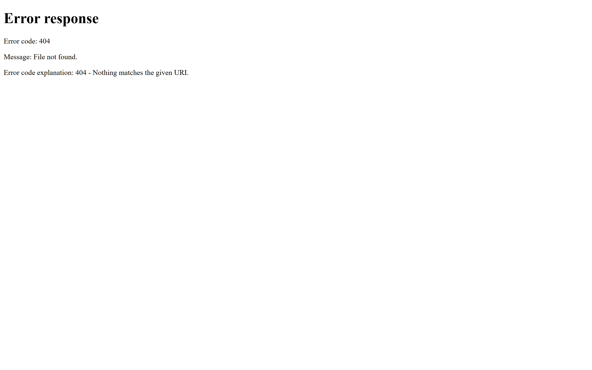
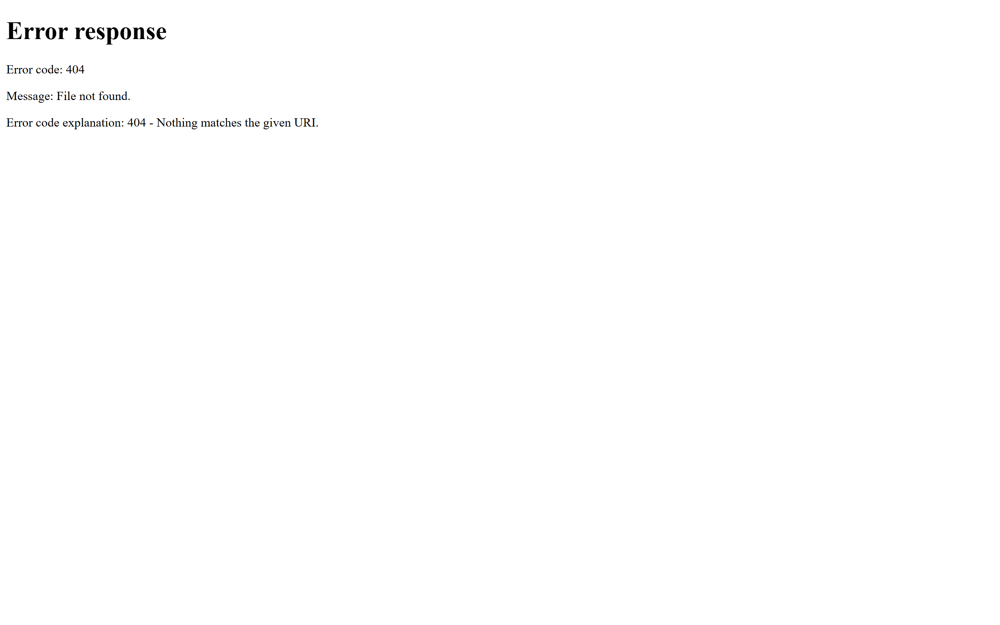
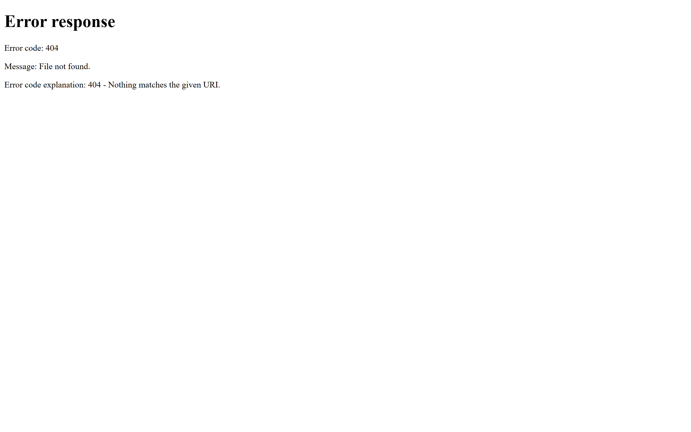

# Uno Game

A classic Uno card game built with Flutter and deployed as a web application.

## 🎮 Play the Game

Visit the live website: [https://innnervision.github.io/Uno-Game/](https://innnervision.github.io/Uno-Game/)

## 📸 Screenshots

### Splash Screen

### Menu Screen

### Game Screen

### Settings

## 🚀 Features

- Classic Uno card game mechanics
- Multiplayer support
- Special cards (Skip, Reverse, Draw Two, Wild)
- Colorful graphics
- Responsive design

## 🛠️ Tech Stack

- Flutter
- Dart
- Firebase (for backend services)

## 📝 License

This project is open source and available under the MIT License.
